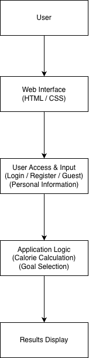

# Fitness Hub - Software Architecture

## 1. Scope
The Fitness Hub system is a web-based fitness application designed to help users estimate their daily calorie needs and support basic health-related decision making. The system allows users to log in, register, or continue as guests. Users can enter personal information such as age, height, weight, gender, and activity level, and the system calculates an estimated daily calorie requirement.

The application also allows users to select a goal such as maintaining weight, losing weight, or gaining weight. Based on the selected goal, the system provides a recommended daily calorie target. The scope of this project focuses on basic calorie calculation and goal selection, and does not include advanced integrations such as wearable devices, live health tracking, or external fitness APIs.

## 2. References
- SWE332 Software Architecture course lecture slides (UZEM platform)
- [4+1 Architectural View Model (Wikipedia)](https://en.wikipedia.org/wiki/4%2B1_architectural_view_model)
- [GitHub Markdown Guide](https://guides.github.com/features/mastering-markdown/)
- [Web Application Architecture Basics](https://www.geeksforgeeks.org/web-application-architecture/)

## 3. Software Architecture

### Software Architecture Diagram

The Fitness Hub system follows a simplified version of the 4+1 architectural view model. The system is designed as a web-based application that separates the user interface, application logic, and execution structure into different views.

The architecture focuses on simplicity and clarity so that the system can be easily understood and developed. The main parts of the system include the user interface, the calorie calculation logic, and the structure used to organize the files and user flow.

This approach helps ensure that the system is easy to maintain and suitable for a small-scale course project developed within limited time and resources.

## 4. Architectural Goals & Constraints

### Goals
- Provide a simple and user-friendly interface
- Allow users to estimate daily calorie needs easily
- Support both logged-in users and guest users
- Keep the system lightweight and responsive
- Make the project easy to develop and maintain

### Constraints
- The system will be developed as a web-based application
- Limited time and resources as this is a course project
- No advanced external APIs or device integrations
- The system will focus on calorie estimation and basic goal selection only
- Guest users will be able to use the system without storing data permanently

## 5. Logical Architecture
The Fitness Hub system is divided into four main components:

1. User Access Component  
This part manages how users enter the system. It includes login, registration, and guest access.

2. User Information Input Component  
This component allows users to enter personal data such as age, height, weight, gender, and activity level.

3. Calorie Calculation Component  
This part processes the entered information and calculates estimated daily calorie needs. It also adjusts the result based on the selected goal, such as maintaining, losing, or gaining weight.

4. Result Display Component  
This component presents the calculated calorie targets and related information clearly to the user.

## 6. Process Architecture
The Fitness Hub system follows a simple process flow:

1. Access Selection  
The user opens the website and chooses to log in, register, or continue as a guest.

2. Data Entry  
The user enters personal information such as age, height, weight, gender, and activity level.

3. Goal Selection  
The user selects a fitness goal, such as maintaining weight, losing weight, or gaining weight.

4. Data Processing  
The system processes the entered data and calculates the estimated daily calorie requirement.

5. Output Display  
The system displays the result and shows the recommended calorie target based on the chosen goal.

## 7. Development Architecture
The system is developed using standard web technologies:

- HTML for page structure
- CSS for styling and layout
- JavaScript for user interaction and calorie calculation logic

The project is organized into separate files for structure, styling, and functionality. This makes the system easier to maintain, update, and test during development.

## 8. Physical Architecture
The system runs through a web browser and does not require special hardware.

- Users can access the system using devices such as laptops, tablets, or smartphones
- The application runs directly in the browser
- Logged-in and guest users use the same web interface
- No advanced server or hardware infrastructure is required for this version of the project

## 9. Scenarios

### Scenario 1: Guest User Calculation
A user opens the website and chooses to continue as a guest. The user enters personal information, selects a goal, and receives a daily calorie recommendation without saving data.

### Scenario 2: Logged-in User Calculation
A registered user logs into the system, enters personal information, selects a goal, and views the calculated calorie target.

### Scenario 3: Goal Comparison
A user enters personal information once and compares calorie recommendations for maintaining weight, losing weight, and gaining weight.

## 10. Size and Performance
- The project uses lightweight web technologies such as HTML, CSS, and JavaScript
- Pages are expected to load quickly because the system does not rely on heavy frameworks
- Calorie calculations are performed instantly within the browser
- The system is designed to work smoothly on modern browsers such as Chrome, Firefox, Safari, and Edge

## 11. Quality
- User Experience: The interface is designed to be simple and easy to understand
- Responsiveness: The system works on both desktop and mobile devices
- Maintainability: Code is separated by purpose, making updates easier
- Reliability: Basic form validation helps prevent invalid input
- Accessibility: Clear text and readable layout improve usability for different users
